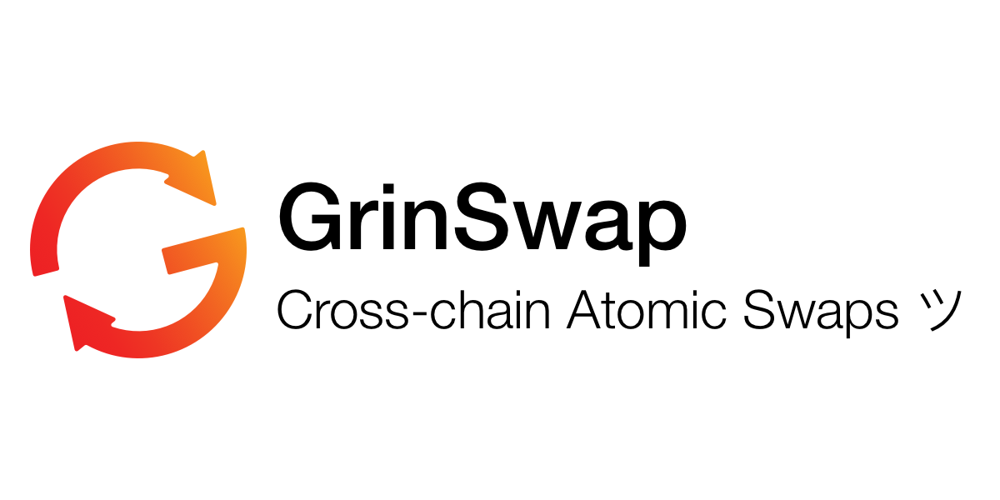

## About

GrinSwap makes it easy for anyone to trade in and out of [Grin](https://github.com/mimblewimble/grin) trustlessly, without the need for a third party. It makes OTC deals a breeze, it introduces a privacy preserving method for buying and selling Grin, and it improves the fungibility and privacy of tokens and assets on the Bitcoin and Ethereum networks.

This is an open source project written in Rust, with development led by @jaspervdm, the creator of the first atomic swaps for [Grin <> ETH](https://medium.com/grinswap/first-grin-atomic-swap-a16b4cc19196) and [Grin <> BTC](https://www.youtube.com/watch?list=PLvgCPbagiHgqYdVUj-ylqhsXOifWrExiq&v=sT3vNycMxw4). 

## Donate
The work on this project is funded by the community, with support from [Binance X](https://binancex.dev/). You can help support this effort by making a donation via the following methods:

* **GRIN**   [grinbox://gVuDf8U6CxjLfa6Wp93iG8jPFnbwuZbVkQuS4vPkatUayNB6u8uX](https://github.com/vault713/wallet713/blob/master/docs/usage.md#transacting-using-grinbox)

* **BTC**   *Coming soon* 

## Development status
This crate can successfully complete a Grin-BTC swap on the testnets, but it needs to be driven by a wallet. There is a WIP integration for wallet713.

Until the v1.0 release of the crate, it is strongly advised _not_ to use it in production, as names/methods/states/flows are subject to change without notice and backward compatibility.

### TODOs
- Handle cancel and refund flows
- Improve connection to Electrum node
- Finalize wallet713 integration
- More testing
- Documentation

## License
Apache License v2.0.